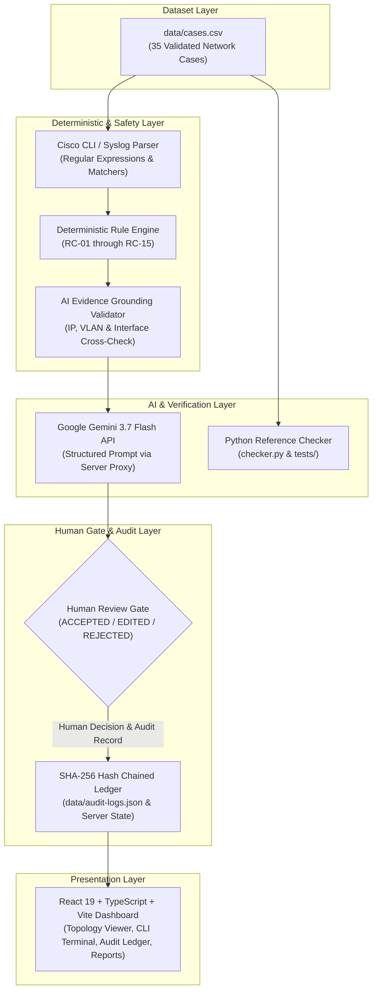

# NetSage AI — AI-Powered Network Diagnostic and Troubleshooting System
## Applied AI + Network Troubleshooting (Cisco IOS & Packet Tracer)

[-brightgreen.svg)]()
[-blue.svg)]()
[]()

NetSage AI is an AI-assisted network troubleshooting and diagnostic system designed for Network Operations Center (NOC) engineers and network students working with Cisco IOS and Packet Tracer topologies. It combines deterministic rule validation with grounded Gemini AI diagnostic reasoning, mandatory human-in-the-loop approval gates, and a cryptographic SHA-256 audit ledger.

---

## 1. Problem Statement & Objectives

Diagnosing enterprise network issues across Layer 1 through Layer 7 is time-consuming and error-prone. Modern NOC teams often face:
- **Alert Fatigue & Multi-Layer Complexity**: Isolating whether an outage is caused by physical cabling, VLAN tagging, dynamic routing (OSPF), DHCP pool exhaustion, or access-list packet drops requires manual inspection across multiple Cisco `show` commands.
- **AI Hallucination Risks**: General-purpose LLMs frequently invent nonexistent IP addresses, wrong VLAN IDs, or dangerous wildcard configurations when given raw network logs.
- **Lack of Governance & Audit Trails**: Unverified AI remediation commands can take down production networks if executed directly without human authorization and cryptographic logging.

### NetSage AI Objectives
1. **Deterministic Rule Engine (RC-01 to RC-15)**: Instantly identify known Cisco IOS configuration anomalies using pattern matching on raw CLI evidence, completely independent of case IDs.
2. **Grounded AI Diagnosis**: Produce structured JSON diagnostic evaluations with root cause, affected OSI layer, categorical confidence (`High`, `Medium`, `Low`), verbatim evidence citations, next verification commands, and remediation steps.
3. **Evidence Grounding & Safety Validator**: Verify that every IP, VLAN, and interface proposed by the AI exists in the provided evidence before presenting it to an operator.
4. **Mandatory Human-in-the-Loop Review**: Enforce operator authorization (`ACCEPTED`, `EDITED`, `REJECTED` with required rationale) before any simulated fix is applied.
5. **Cryptographic SHA-256 Audit Trail**: Record all ingestion events, AI analyses, and human review decisions in an immutable, tamper-evident hash chain.
6. **Simulation Safety**: Operate strictly in a safe simulation sandbox without executing live device writes.

---

## 2. Architecture & Data Flow



### Current Implementation Architecture
The NetSage AI application is implemented as a full-stack web application:
- **Frontend**: React 19, TypeScript, Tailwind CSS, Lucide icons, Motion animations, and jsPDF client-side report generation.
- **Backend API**: Node.js and Express (`server.ts`) proxying Gemini API requests, serving static assets, and managing live SHA-256 audit logs.
- **Rule Engines**: Dual-engine architecture featuring a TypeScript rule engine (`src/engine/checker.ts` and `src/engine/rules/*`) and an independent reference Python rule engine (`src/checker.py` and `checker.py`).
- **Data Persistence**: Single source of truth dataset in `data/cases.csv` and sequential cryptographic audit ledger in `data/audit-logs.json`.

---

## 3. Technology Stack

- **Frontend**: React 19, TypeScript 5.7+, Tailwind CSS 4+, Lucide React, Motion (Framer Motion)
- **Backend Server**: Node.js, Express, esbuild, TypeScript (`tsx`)
- **AI Diagnostics**: Google Gemini API (`@google/genai`) configured for Gemini 3.7 Flash
- **Cryptographic Security**: Node.js `crypto` (`sha256`), Python `hashlib`
- **Testing & Verification**: TypeScript verification runner (`tsx src/engine/runner.ts`), Python `unittest` (`python3 -m unittest discover tests`), Python compliance runner (`python3 checker.py --all-cases`)
- **Reporting**: jsPDF client-side PDF synthesis with cryptographic token stamping

---

## 4. Authoritative Dataset Breakdown (35 Cases)

NetSage AI includes 35 validated network troubleshooting cases in `data/cases.csv`, exceeding the project requirement of at least 30 cases across 8 core networking domains:

| Domain | Case Count | Example Case IDs | Target Technologies & Symptoms |
|---|:---:|---|---|
| **VLAN & Trunking** | 21 | `NET-006`, `NET-007`, `NET-015`, `NET-020`, `NET-026`, `NET-035` | 802.1Q encapsulation, native VLAN mismatch, missing VLAN database, trunk pruning |
| **Routing (L3/OSPF)** | 17 | `NET-004`, `NET-008`, `NET-014`, `NET-021`, `NET-025` | OSPF subnet mask mismatch, missing static default route, missing route redistribution |
| **Gateway & Inter-VLAN** | 13 | `NET-001`, `NET-005`, `NET-012`, `NET-017`, `NET-019`, `NET-022`, `NET-028`, `NET-029` | Sub-interface shutdown, wrong 802.1Q sub-interface tag, duplicate gateway SVI IP |
| **IPAM & Duplication** | 6 | `NET-003`, `NET-005`, `NET-017`, `NET-019`, `NET-029` | Duplicate server IP, duplicate SVI, client subnet mismatch |
| **DHCP Services** | 5 | `NET-010`, `NET-023`, `NET-031` | DHCP pool exhaustion, missing `ip helper-address` relay |
| **Security & ACLs** | 5 | `NET-009`, `NET-018`, `NET-027`, `NET-030`, `NET-034` | Inbound ACL blocking web (80), SSH (22), DNS (53), guest isolation bypass |
| **NAT Operations** | 7 | `NET-011`, `NET-024` | Inside/outside interface misconfiguration, NAT overload pool exhaustion |
| **Wireless (WLC/AP)** | 5 | `NET-031`, `NET-032`, `NET-033`, `NET-034`, `NET-035` | AP-to-WLC connectivity failure, WLAN VLAN mapping, guest isolation, DHCP over Wi-Fi |

Each dataset row contains 12 verified fields: `case_id`, `title`, `symptom`, `topology_note`, `show_outputs`, `expected_fault`, `expected_osi_layer`, `concept_tag`, `severity`, `expected_next_command`, `expected_fix_steps`, and `expected_rule_ids`.

---

## 5. Deterministic Rule Engine (RC-01 to RC-15)

The deterministic rule engine evaluates raw Cisco show outputs and syslogs against 15 rules without referencing case IDs:

- **RC-01 (Interface Admin Down)**: Detects `administratively down` interfaces and sub-interfaces (`no shutdown` required).
- **RC-02 (Physical Line Protocol Down)**: Detects physical disconnected state (`line protocol is down` / `notconnect`).
- **RC-03 (Subnet Mask Mismatch)**: Detects mismatched subnet masks on point-to-point router links preventing OSPF adjacency.
- **RC-04 (Default Gateway Mismatch)**: Identifies misconfigured default gateways on client devices.
- **RC-05 (Duplicate IP Conflict)**: Detects duplicate IP address assignments causing ARP table poisoning and routing conflicts.
- **RC-06 (Missing VLAN in Database)**: Detects ports assigned to VLANs that do not exist in the switch VLAN database.
- **RC-07 (Native VLAN Trunk Mismatch)**: Identifies native VLAN mismatches across 802.1Q trunk links causing VLAN leaking.
- **RC-08 (Missing Static Route / OSPF Statement)**: Identifies missing routing table entries, default routes, or OSPF network statements.
- **RC-09 (ACL Blocking Essential Traffic)**: Detects explicit access-list deny statements blocking web (80), SSH (22), or DNS (53).
- **RC-10 (DHCP Pool Exhausted / AP Failure)**: Identifies depleted DHCP address ranges preventing client leases.
- **RC-11 (Missing DHCP Helper Address)**: Detects missing `ip helper-address` on router interfaces separating clients from DHCP servers.
- **RC-12 (NAT Translation Pool Exhaustion)**: Detects dropped packets caused by depleted NAT overload pools.
- **RC-13 (Port-Security Errdisable)**: Identifies access switchports in `err-disabled` state due to MAC address violations.
- **RC-14 (NAT Interface Role Misconfiguration)**: Detects inverted `ip nat inside` and `ip nat outside` interface declarations.
- **RC-15 (Sub-interface Encapsulation Mismatch)**: Detects sub-interface ID mismatch with configured `encapsulation dot1Q <vlan>` tag.

---

## 6. AI Diagnostic Engine & Responsible AI Controls

NetSage AI queries Gemini 3.7 Flash using a rigid JSON schema defined in `prompts/diagnose_prompt.md`:

```json
{
  "root_cause": "Concise, technically grounded description of the network fault.",
  "osi_layer": "Layer 1 (Physical) | Layer 2 (Data Link) | Layer 3 (Network) | Layer 4 (Transport) | Layer 7 (Application)",
  "confidence": "High | Medium | Low",
  "evidence": ["Verbatim quote 1 from show output", "Verbatim quote 2"],
  "next_command": "show running-config interface GigabitEthernet0/0.30",
  "fix_steps": ["configure terminal", "interface GigabitEthernet0/0.30", "no shutdown"]
}
```

### Safety & Grounding Controls
1. **Schema Validation**: Rejects non-conforming responses, invalid OSI layer values, or invalid confidence categories.
2. **Evidence Grounding**: Cross-references every IP address, VLAN ID, and interface name in the AI output against the provided show outputs. If the model hallucinates an unprovided network entity, the diagnosis is flagged and confidence is downgraded.
3. **Ground-Truth Isolation**: The diagnostic prompt completely omits expected fault and answer fields (`expected_fault`, `expected_next_command`, `expected_fix_steps`), forcing the AI to diagnose purely from symptoms and show outputs.
4. **Categorical Confidence**: Confidence is reported as `High`, `Medium`, or `Low`. (Numeric percentages in the UI are presentation indicators, not calibrated probabilities).
5. **Fallback on Insufficient Evidence**: If evidence is ambiguous, the system assigns `Low` confidence and recommends diagnostic verification commands.

---

## 7. Human-in-the-Loop Review & SHA-256 Audit Trail

All AI-suggested remediation commands are held at a mandatory human review gate:
- **ACCEPTED**: The reviewing engineer approves the suggested remediation as-is.
- **EDITED**: The operator modifies configuration commands to match organizational policy before approving. Both the original AI commands and the operator-edited commands are preserved.
- **REJECTED**: The operator rejects the remediation. A mandatory rejection reason is required to maintain audit completeness.

### Cryptographic Audit Ledger
Every action creates a record in `data/audit-logs.json` containing:
- ISO timestamp, case ID, action type, target node, reviewer name, decision, commands, and rejection rationale.
- `previousHash`: The SHA-256 digest of the previous block (`sha256:genesis_block_init` for block 0).
- `currentHash`: SHA-256 digest computed over the record's payload combined with `previousHash`.

Tamper detection is verified via `/api/audit/verify` and automated unit tests covering 10 distinct attack vectors (payload modification, timestamp tampering, hash alteration, record deletion, reordering, and injection).

---

## 8. Master Verification & QA Suite (284 Checks)

The repository provides a single command for complete independent verification:

```bash
npm run verify
```

### Verification Pipeline Breakdown

```text
================================================================================
           NETSAGE AI — MASTER INDEPENDENT VERIFICATION SUMMARY                 
================================================================================
TypeScript Static Type Check               [PASS] (1/1 tests passed)
Master TypeScript Verification Suite       [PASS] (199/199 tests passed)
Python Reference Unit Tests                [PASS] (48/48 tests passed)
Python Dataset Compliance Checker          [PASS] (35/35 tests passed)
Production Asset Build                     [PASS] (1/1 tests passed)
--------------------------------------------------------------------------------
TOTAL CHECKS EXECUTED:    284
TOTAL CHECKS PASSED:      284
TOTAL CHECKS FAILED:      0
OVERALL VERIFICATION:     PASS (100% VERIFIED)
================================================================================
```

### Individual Execution Commands

```bash
# Run TypeScript Static Type Checking
npm run lint

# Run Master TypeScript Verification Suite (199 checks)
npm test

# Run Python Reference Unit Tests (48 tests)
python3 -m unittest discover tests

# Run Python Dataset Compliance Checker (35 cases)
python3 checker.py --all-cases

# Run Production Asset Build
npm run build
```

---

## 9. Installation & Getting Started

### Prerequisites
- Node.js 18+ and npm 9+
- Python 3.10+ (for reference unit tests and checker)

### Installation
```bash
# Clone the repository
git clone https://github.com/shouryarai720-ui/NetSage-AI.git
cd NetSage-AI

# Install dependencies
npm install
```

### Development Server
```bash
# Start the full-stack development server on port 3000
npm run dev
```

Open `http://localhost:3000` to access the full-stack application.

---

## 10. Project Directory Structure

```text
NetSage-AI/
├── data/
│   ├── cases.csv                 # Authoritative 35-case dataset
│   ├── cases.json                # JSON representation of dataset
│   ├── audit-logs.json           # SHA-256 cryptographic audit chain
│   └── system_config.json        # Rule definitions and system settings
├── docs/
│   ├── technical-documentation.md           # Authoritative technical document
│   ├── documentation-consistency-report.md # Documentation consistency audit
│   ├── independent-verification-report.md  # Independent verification audit
│   ├── requirements-matrix.md              # Requirements traceability matrix
│   ├── final-qa-report.md                  # Comprehensive QA report
│   ├── test-matrix.md                      # Test matrix across 35 cases
│   └── model_audit_log.md                  # 5 Responsible AI calibration logs
├── prompts/
│   └── diagnose_prompt.md        # System prompt, schema, & few-shot examples
├── src/
│   ├── components/
│   │   ├── cases/                # Cases directory page
│   │   ├── dashboard/            # Overview & hero experience
│   │   ├── diagnostics/          # Topology, CLI, AI panel, HITL review
│   │   ├── governance/           # Audit ledger, reports, test center
│   │   ├── intelligence/         # AI insights, Responsible AI page
│   │   ├── layout/               # Header, sidebar, search modal
│   │   ├── network/              # Network health monitor
│   │   └── system/               # System settings & configuration
│   ├── engine/
│   │   ├── rules/                # RC-01 to RC-15 rule implementations
│   │   ├── aiValidator.ts        # AI schema & evidence grounding validation
│   │   ├── checker.ts            # TypeScript deterministic rule engine
│   │   ├── parse-checker.ts      # Fail-safe reporting & invariant parser
│   │   ├── runner.ts             # Master TypeScript test suite runner
│   │   ├── verify-all.ts         # Unified 5-stage verification pipeline
│   │   └── test-*.ts             # TypeScript unit & integration test suites
│   ├── utils/
│   │   └── pdfExport.ts          # Tamper-sealed PDF incident report generator
│   ├── App.tsx                   # Main React application component
│   ├── cases.ts                  # Dataset loader & types
│   ├── main.tsx                  # React entry point
│   ├── types.ts                  # Shared TypeScript interfaces
│   ├── checker.py                # Python deterministic checker module
│   └── engine.py                 # Python helper engine module
├── tests/
│   ├── test_ai_grounding.py      # Python AI grounding unit tests
│   ├── test_audit.py             # Python cryptographic audit unit tests
│   ├── test_checker.py           # Python rule engine unit tests
│   ├── test_dataset.py           # Python dataset schema unit tests
│   ├── test_engine.py            # Python engine utility unit tests
│   └── test_reporting_failure_modes.py # Python reporting failure mode tests
├── test-results/
│   ├── independent-verification.json # Machine-readable verification results
│   ├── verification-report.json      # Master pipeline execution summary
│   └── full-dataset-results.json     # Case-by-case diagnosis results
├── checker.py                    # Standalone Python CLI compliance runner
├── server.ts                     # Full-stack Express backend & Vite middleware
├── package.json                  # Scripts & dependencies
├── tsconfig.json                 # TypeScript compiler configuration
└── vite.config.ts                # Vite frontend bundler configuration
```

---

## 11. Limitations & Simulation Safety

- **Simulation Sandbox**: NetSage AI runs in simulation mode. It does not issue live SSH/Telnet configuration writes to physical Cisco hardware. All remediation commands are generated for operator review, dry-run testing, and lab simulation.
- **Packet Tracer Scope**: Evidence parsing is optimized for Cisco IOS 15.x/17.x syntax and Cisco Packet Tracer CLI outputs. Non-Cisco syntax (e.g., Junos, Arista EOS) is not supported.
- **API Availability**: Live AI diagnostic analysis requires a valid `GEMINI_API_KEY` configured in the server environment. If the API key is not configured, the application falls back to deterministic rule analysis.

---

## 12. License
MIT License. Built for secure, responsible AI-assisted network operations.

