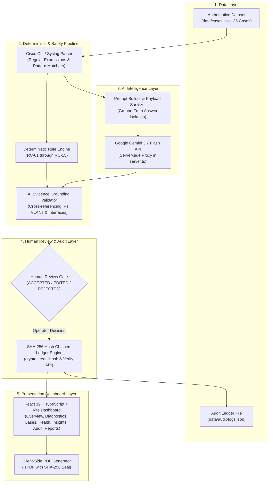
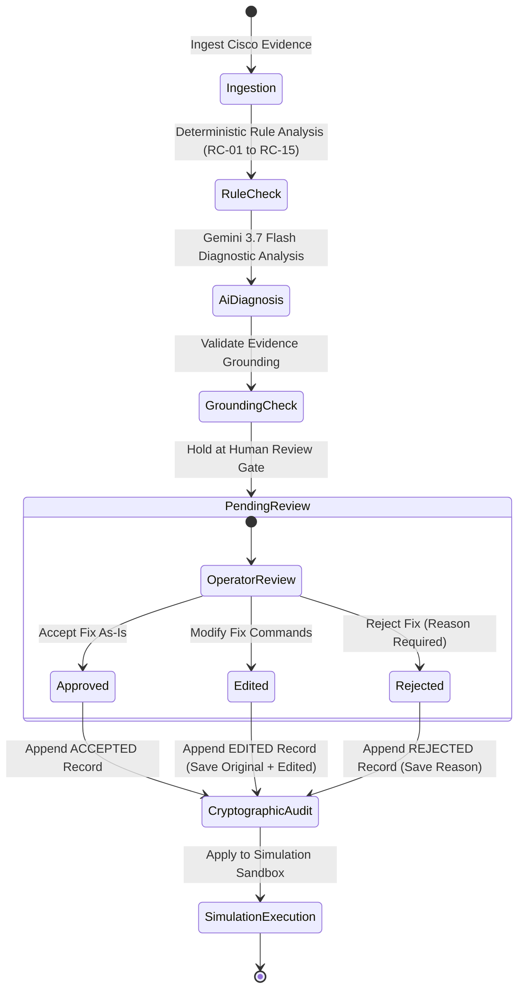

# NetSage AI — Technical Documentation
## AI-Powered Network Diagnostic and Troubleshooting System for Cisco IOS & Packet Tracer Topologies

---

## 1. Executive Summary & Problem Statement

### 1.1 Objective
NetSage AI is an AI-assisted network troubleshooting and diagnostic system engineered for Network Operations Center (NOC) engineers and network students. It diagnoses complex network anomalies across Layer 1 through Layer 7 in Cisco IOS and Packet Tracer topologies by combining deterministic pattern-matching rules, structured Gemini AI diagnostic reasoning, evidence grounding validation, mandatory human approval gates, and a cryptographic SHA-256 audit ledger.

### 1.2 The Network Troubleshooting Problem
Modern enterprise networks integrate multi-layer switches, VLAN trunks, dynamic routing protocols (OSPF), DHCP services, NAT overload gateways, and wireless LAN controllers (WLCs). When connectivity fails, troubleshooting presents several challenges:
- **Multi-Layer Diagnostic Ambiguity**: A failing ping could be caused by an administratively down sub-interface (L3/L1), a mismatched trunk native VLAN (L2), an OSPF subnet mask mismatch (L3), an exhausted DHCP pool (L3/L7), or an access list blocking specific TCP/UDP ports (L4).
- **Manual Log Analysis Overhead**: Network engineers must manually run and cross-examine dozens of Cisco CLI commands (`show ip interface brief`, `show interfaces trunk`, `show ip route`, `show ip nat translations`, `show access-lists`, `show ip dhcp pool`).
- **AI Hallucination & Risk in Infrastructure**: General-purpose LLMs given network logs frequently fabricate invalid IP addresses, hallucinate switchports, or propose overly permissive commands (such as `permit ip any any`) that compromise network security.
- **Lack of Governance & Accountability**: Unverified AI remediation applied directly to production hardware can cause severe network outages. Every proposed configuration command must pass through human verification and be recorded in a tamper-evident audit trail.

---

## 2. Architecture Evolution & Current Implementation

### 2.1 Evolution from Concept to Full-Stack Application
The implementation architecture was refined during development while preserving all functional requirements, rules, dataset scenarios, and safety constraints defined in the original project specification:

| Architecture Area | Initial Concept / Prototype | Current Implemented Architecture | Status & Reason |
|:---|:---|:---|:---|
| **Frontend Framework** | Static/Python UI Prototype | React 19 + TypeScript + Vite + Tailwind CSS | Implemented: High-performance interactive dashboard with dynamic topology visualization, interactive CLI console, and modular views. |
| **Backend / API Layer** | Script execution | Node.js + Express (`server.ts`) | Implemented: Secure server-side proxy for Gemini 3.7 Flash API, live cryptographic audit logging, and static asset serving. |
| **Deterministic Engine** | Standalone Python module | Dual TypeScript & Python Engines (`src/engine/checker.ts` and `src/checker.py`) | Implemented: 100% parity across TypeScript and Python engines for rules RC-01 to RC-15 with zero case-ID dependencies. |
| **AI Model & Provider** | Generic LLM concept | Google Gemini 3.7 Flash via `@google/genai` | Implemented: Server-side invocation with rigid JSON schema, few-shot calibration, and regex evidence grounding validation. |
| **Dataset Storage** | Ad-hoc scenario files | Authoritative Single Source of Truth (`data/cases.csv`) | Implemented: 35 fully structured and validated cases covering 8 networking domains with 12 metadata columns. |
| **Audit Ledger** | Basic text logs | Sequential SHA-256 Hash Chained Ledger (`data/audit-logs.json`) | Implemented: Cryptographic hash chain with tamper detection against 10 attack vectors via `/api/audit/verify`. |
| **Human-in-the-Loop** | Unstructured review | Strict 3-state gate (`ACCEPTED`, `EDITED`, `REJECTED`) | Implemented: Mandatory human approval before remediation simulation; mandatory reason required for rejections. |
| **Verification Pipeline** | Manual test execution | Unified Automated Master Pipeline (`npm run verify`) | Implemented: Single command executing 284 checks across TypeScript static check, TypeScript test suite, Python unit tests, Python dataset checker, and production build. |

### 2.2 System Architecture & Component Interactions



---

## 3. Technology Stack & Dependencies

### Frontend
- **React 19**: Modern component architecture with functional hooks.
- **TypeScript 5.7+**: End-to-end type safety across components, models, and rule definitions.
- **Vite 6+**: High-speed frontend bundling and asset management.
- **Tailwind CSS 4+**: Utility-first responsive design supporting light and dark themes.
- **Lucide React**: Clean, accessible iconography.
- **Motion (Framer Motion)**: Fluid UI transitions and interactive visual states.
- **jsPDF**: Client-side synthesis of cryptographic PDF incident reports.

### Backend Server
- **Node.js 18+ / 20+**: Core JavaScript runtime environment.
- **Express**: REST API server hosting `/api/cases`, `/api/diagnose`, `/api/audit/*`, `/api/verify-full-dataset`, and static asset delivery.
- **@google/genai**: Official Google Gen AI SDK for Gemini 3.7 Flash structured inference.
- **Node Crypto**: Native SHA-256 cryptographic hashing for immutable audit chaining.
- **esbuild**: Server bundling into `dist/server.cjs`.

### Python Reference Tooling
- **Python 3.10+**: Reference implementation of deterministic rules, dataset validation, and unit tests.
- **Standard Libraries**: `pathlib`, `json`, `csv`, `re`, `argparse`, `unittest`, `hashlib`.

---

## 4. Authoritative 35-Case Dataset & Taxonomy

The dataset resides in `data/cases.csv` as the single authoritative source of truth. It contains 35 real-world network failure scenarios across 8 core networking domains:

```text
35 Troubleshooting Cases (Exceeds minimum project requirement of 30 cases)
├── VLAN & Trunking:       21 cases (802.1Q encapsulation, native VLAN leaks, missing VLANs)
├── Routing (L3 / OSPF):   17 cases (Subnet mask mismatches, missing routes, redistribution)
├── Gateway & Inter-VLAN:  13 cases (Sub-interface shutdown, wrong VLAN tags, SVI conflicts)
├── IPAM & Duplication:    6 cases (Duplicate host IP, duplicate SVI, address conflicts)
├── NAT Operations:        7 cases (Inside/outside misassignment, overload pool exhaustion)
├── Security & ACLs:       5 cases (Inbound port filtering, SSH/DNS blocks, guest isolation)
├── DHCP Services:         5 cases (Pool exhaustion, missing ip helper-address relay)
└── Wireless (WLC / AP):   5 cases (WLAN VLAN mapping, AP-WLC discovery, Wi-Fi DHCP)
```

### Dataset Schema Fields (12 Verified Columns)
1. `case_id`: Unique identifier (e.g., `NET-001` through `NET-035`).
2. `title`: Concise human-readable scenario title.
3. `symptom`: High-level operational problem description reported by users or monitoring tools.
4. `topology_note`: JSON-encoded network topology definition (nodes, links, interfaces, coordinates, and statuses).
5. `show_outputs`: Verbatim Cisco IOS CLI output from switches, routers, and firewalls (`show ip interface brief`, `show running-config`, `show ip route`, `show ip nat translations`, `show access-lists`, `show vlan brief`, `show interfaces trunk`, etc.).
6. `expected_fault`: Authoritative root-cause explanation for verification benchmarking.
7. `expected_osi_layer`: Target OSI layer (`Layer 1 (Physical)`, `Layer 2 (Data Link)`, `Layer 3 (Network)`, `Layer 4 (Transport)`, `Layer 7 (Application)`).
8. `concept_tag`: Domain classification tag (e.g., `Inter-VLAN Routing`, `L2 Trunking`, `L3 NAT`, `Wireless`).
9. `severity`: Operational impact (`Low`, `Medium`, `High`, `Critical`).
10. `expected_next_command`: Optimal Cisco IOS verification command to confirm the fault.
11. `expected_fix_steps`: Step-by-step Cisco IOS CLI remediation commands.
12. `expected_rule_ids`: Associated deterministic rule identifier (`RC-01` to `RC-15`).

---

## 5. Deterministic Rule Engine (RC-01 through RC-15)

The deterministic rule engine inspects raw Cisco CLI evidence text and matches configuration defects using regular expressions without referencing the case ID:

| Rule ID | Rule Name | Target OSI Layer | Severity | Diagnostic Pattern / Detection Logic | Remediation Output |
|:---|:---|:---|:---|:---|:---|
| **RC-01** | Interface Administratively Down | Layer 3 / Layer 1 | High | Matches interface status `administratively down` in `show ip interface brief`. | `interface <iface>`<br>`no shutdown` |
| **RC-02** | Physical Line Protocol Down | Layer 1 | Medium | Matches `is down, line protocol is down (notconnect)` or hardware disconnected logs. | Check physical patch cable, verify remote SFP/NIC power, and test transceiver. |
| **RC-03** | Subnet Mask Mismatch on Link | Layer 3 | High | Detects differing subnet masks on point-to-point router links (e.g., `/30` vs `/24`) or syslog `OSPF-4-ERRRCV: Mismatched mask`. | Reconfigure interface mask to match point-to-point subnet. |
| **RC-04** | Default Gateway Mismatch | Layer 3 | Medium | Detects client gateway configured outside the local subnet or pointing to an unassigned IP. | Update client IP configuration default gateway address. |
| **RC-05** | Duplicate IP Address Conflict | Layer 3 | Critical | Detects `Duplicate IP address ... on GigabitEthernet...` or duplicate ARP log entries. | Reassign conflicting static host/SVI IP address. |
| **RC-06** | Missing VLAN in Database | Layer 2 | High | Detects switchport access VLAN assigned on an interface but missing from `show vlan brief`. | `vlan <id>`<br>`name <vlan_name>` |
| **RC-07** | Native VLAN Trunk Mismatch | Layer 2 | Medium | Matches `CDP-4-NATIVE_VLAN_MISMATCH` or differing native VLAN IDs across trunk ends. | `interface <trunk_iface>`<br>`switchport trunk native vlan <id>` |
| **RC-08** | Missing Route / OSPF Network | Layer 3 | High | Identifies missing default gateway route (`Gateway of last resort is not set`) or missing OSPF `network` statement. | Add `ip route 0.0.0.0 0.0.0.0 <nh>` or configure OSPF network area statement. |
| **RC-09** | ACL Blocking Essential Port | Layer 4 | High | Matches `deny tcp ... eq www/22/53` or explicit deny entries dropping required application traffic. | Insert `permit` ACE prior to the blocking deny entry. |
| **RC-10** | DHCP Pool Exhausted / AP Fail | Layer 3 | Medium | Matches `DHCP-4-POOL_EXHAUSTED` or `Address pool exhausted` in DHCP server statistics. | Expand DHCP scope pool or clear expired bindings. |
| **RC-11** | Missing DHCP Helper Address | Layer 3 | High | Identifies router interface in a routed subnet lacking `ip helper-address <dhcp_server_ip>`. | `interface <iface>`<br>`ip helper-address <server_ip>` |
| **RC-12** | NAT Translation Pool Exhaustion | Layer 3 | High | Matches `NAT-4-POOL_EXHAUSTION` or dropped translations in `show ip nat statistics`. | Increase NAT overload address pool or configure `ip nat inside source list ... overload`. |
| **RC-13** | Port-Security Errdisable | Layer 1 / Layer 2 | Medium | Matches `is down, line protocol is down (err-disabled)` or `PM-4-ERR_DISABLE: psecure-violation`. | `interface <iface>`<br>`shutdown`<br>`no shutdown` |
| **RC-14** | NAT Interface Role Inverted | Layer 3 | High | Identifies misconfigured `ip nat inside` and `ip nat outside` on boundary interfaces. | Correct `ip nat inside` on LAN and `ip nat outside` on WAN interfaces. |
| **RC-15** | Sub-interface Encapsulation Mismatch | Layer 2 | High | Detects sub-interface number mismatch with `encapsulation dot1Q <vlan>` tag. | `interface <iface>.<vlan>`<br>`encapsulation dot1Q <vlan>` |

---

## 6. AI Diagnostic Engine & Structured Schema

### 6.1 Prompt Architecture & System Instructions
NetSage AI formats diagnostic requests using the system prompt in `prompts/diagnose_prompt.md`. The prompt isolates the LLM from ground-truth answer metadata (`expected_fault`, `expected_next_command`, `expected_fix_steps`), requiring the model to diagnose strictly from the symptom and show command outputs.

### 6.2 Structured Output Schema
The model returns valid JSON conforming to the following schema:

```json
{
  "type": "object",
  "required": ["root_cause", "osi_layer", "confidence", "evidence", "next_command", "fix_steps"],
  "properties": {
    "root_cause": {
      "type": "string",
      "description": "Technical root cause explanation grounded solely in provided evidence."
    },
    "osi_layer": {
      "type": "string",
      "enum": [
        "Layer 1 (Physical)",
        "Layer 2 (Data Link)",
        "Layer 3 (Network)",
        "Layer 4 (Transport)",
        "Layer 7 (Application)"
      ]
    },
    "confidence": {
      "type": "string",
      "enum": ["High", "Medium", "Low"],
      "description": "Categorical model confidence rating."
    },
    "evidence": {
      "type": "array",
      "items": { "type": "string" },
      "description": "Array of verbatim citations extracted from CLI show outputs."
    },
    "next_command": {
      "type": "string",
      "description": "Single most effective Cisco IOS verification command."
    },
    "fix_steps": {
      "type": "array",
      "items": { "type": "string" },
      "description": "Sequential Cisco IOS CLI commands to remediate the diagnosed fault."
    }
  }
}
```

### 6.3 Categorical Confidence vs Presentation Scoring
Model confidence is strictly categorical (`High`, `Medium`, `Low`). Numerical values displayed in the UI (e.g., 95%, 75%, 45%) are visual presentation scores mapped to these categories rather than calibrated Bayesian statistical probabilities.

---

## 7. Responsible AI & Hallucination Prevention Controls

To prevent ungrounded AI behavior in network operations, NetSage AI enforces seven safety controls:

1. **Evidence Grounding Validator**: The system extracts all IP addresses, subnets, VLAN IDs, and interface identifiers from the AI response and cross-checks them against the supplied CLI evidence text using regex extractors (`src/engine/aiValidator.ts`). If the AI references an unprovided network entity, the diagnosis is flagged as ungrounded and confidence is downgraded.
2. **Strict Schema Validation**: Non-JSON responses or objects missing required fields are automatically rejected.
3. **Ground-Truth Isolation**: The diagnostic prompt payload omits authoritative answer fields, ensuring zero data leakage.
4. **Mandatory Human-in-the-Loop Gate**: No remediation commands can be applied to the simulation sandbox without explicit operator review.
5. **No Direct Hardware Execution**: All actions are executed in simulation mode; the system never issues live SSH/Telnet writes to physical devices.
6. **Calibration Correction Records**: Five curated safety calibration logs are documented in `docs/model_audit_log.md` detailing cases where human reviewers corrected AI errors (e.g., preventing over-permissive ACL wildcards).
7. **Simulation Disclaimers**: Persistent visual indicators remind operators that they are operating in a simulated environment.

---

## 8. Human-in-the-Loop (HITL) Workflow



### Decision States
- **ACCEPTED**: The reviewing engineer verifies and accepts the AI-recommended fix steps as-is.
- **EDITED**: The operator modifies configuration commands to match company naming standards or security policies. The system saves both `originalCommands` and `editedCommands`.
- **REJECTED**: The operator rejects the proposed fix. A mandatory rejection reason must be supplied and is recorded in the audit log.

---

## 9. Cryptographic SHA-256 Audit Trail

All system events, AI diagnostic outputs, and human decisions are appended to an immutable, sequential SHA-256 hash-chained audit log stored in `data/audit-logs.json`.

### Block Structure
Each log entry contains:
```json
{
  "timestamp": "2026-08-21T10:49:34.379Z",
  "caseId": "NET-001",
  "actionType": "HUMAN GATE PASS",
  "targetNode": "CORE-ROUTER-01",
  "message": "Operator approved remediation for sub-interface GigabitEthernet0/0.30.",
  "safetyStatus": "SECURE",
  "humanDecision": "ACCEPTED",
  "reviewer": "NOC-Lead-Engineer",
  "originalCommands": ["configure terminal", "interface GigabitEthernet0/0.30", "no shutdown"],
  "previousHash": "sha256:4a7e93f7467e2a945b0a39f60f612d579f150f8cbcfef82845c4aa029f63628e",
  "currentHash": "sha256:d8b2f918e5b47a61d15c91e3e7f603214b7218ef8f8280f58bb71c26027abecf"
}
```

### Hash Computation & Tamper Detection
- For block 0 (genesis block), `previousHash` is `sha256:genesis_block_init`.
- For block $N$, `currentHash` is computed as:
  $$\text{currentHash} = \text{SHA-256}(\text{JSON}(\text{payload}) + \text{previousHash})$$
- The `/api/audit/verify` endpoint recomputes the entire hash chain from genesis to head and verifies all block links. Automated tests (`tests/test_audit.py` and `src/engine/test-human-audit.ts`) verify that any modification, deletion, reordering, or injection of records triggers an immediate cryptographic validation failure.

---

## 10. User Interface Architecture

The React 19 web dashboard provides 10 dedicated functional views:

1. **Overview Dashboard** (`src/components/dashboard/OverviewPage.tsx`): High-level operational metrics, active incident summary, quick diagnostics launcher, and system status indicators.
2. **Diagnostics Workspace** (`src/components/diagnostics/DiagnosticsPage.tsx`): Interactive incident workspace featuring SVG network topology maps (`TopologyHero.tsx`), interactive Cisco CLI console (`CiscoCliTerminal.tsx`), deterministic rule outputs (`DeterministicRulePanel.tsx`), AI diagnostic recommendations (`AiDiagnosisPanel.tsx`), and the human review approval panel (`HumanReviewPanel.tsx`).
3. **Cases Directory** (`src/components/cases/CasesDirectoryPage.tsx`): Searchable catalog of all 35 troubleshooting cases with domain filters, severity badges, and quick-load triggers.
4. **Network Health Monitor** (`src/components/network/NetworkHealthPage.tsx`): Interactive topology visualization displaying real-time link statuses, device health, and simulated fault injection points.
5. **AI Insights Dashboard** (`src/components/intelligence/AiInsightsPage.tsx`): Aggregated diagnostic trends, common root causes, affected OSI layer distributions, and model performance metrics.
6. **Responsible AI & Governance** (`src/components/intelligence/ResponsibleAiPage.tsx`): Detailed documentation of safety guardrails, hallucination prevention mechanisms, and 5 documented human correction calibration records.
7. **Audit Ledger View** (`src/components/governance/AuditPage.tsx`): Real-time cryptographic ledger inspection displaying block hashes, human review decisions, tamper verification triggers, and audit record details.
8. **Executive Reports** (`src/components/governance/ReportsPage.tsx`): Incident reporting hub with client-side cryptographic PDF generation (`pdfExport.ts`) and JSON export capabilities.
9. **Test Center** (`src/components/governance/TestCenterPage.tsx`): Interactive verification center displaying live test results across all 284 automated checks.
10. **System Settings** (`src/components/system/SettingsPage.tsx`): Simulation environment configuration, API status indicators, and safety threshold controls.

---

## 11. Testing & Independent Verification Suite

NetSage AI provides a comprehensive 5-stage automated verification pipeline executable via a single command:

```bash
npm run verify
```

### Complete Verification Results (284 Checks Executed)

| Layer / Stage | Command | Checks | Passed | Failed | Status |
|:---|:---|:---:|:---:|:---:|:---:|
| **1. Static Type Checking** | `npm run lint` (`tsc --noEmit`) | 1 | 1 | 0 | **PASS** |
| **2. Master TypeScript Suite** | `npm test` (`tsx src/engine/runner.ts`) | 199 | 199 | 0 | **PASS** |
| **3. Python Reference Unit Tests** | `python3 -m unittest discover tests` | 48 | 48 | 0 | **PASS** |
| **4. Python Dataset Compliance** | `python3 checker.py --all-cases` | 35 | 35 | 0 | **PASS** |
| **5. Production Asset Build** | `npm run build` | 1 | 1 | 0 | **PASS** |
| **TOTAL PIPELINE EXECUTION** | `npm run verify` | **284** | **284** | **0** | **PASS (100%)** |

### Breakdown of the Master TypeScript Suite (199 Checks)
- **Dataset Schema & Domain Coverage**: 35 checks verifying 12 required fields and 8-domain coverage across `data/cases.csv`.
- **Deterministic Rule Matrix (RC-01 to RC-15)**: 66 checks covering positive cases (17), negative & similar-valid cases (30), edge cases (15), and case-ID independence (4).
- **Fuzz & Robustness Engine**: 16 stress tests evaluating empty inputs, binary payloads, Unicode strings, and 10,000+ character console logs.
- **AI Safety & Evidence Grounding**: 19 checks validating JSON schema conformity (11), evidence citation grounding (4), insufficient evidence handling (2), and ground-truth isolation (2).
- **Human Review & SHA-256 Audit Chain**: 16 checks verifying HITL state transitions (6) and cryptographic tamper resistance across 10 attack vectors (10).
- **Authoritative Dataset Full Run**: 35 end-to-end case diagnoses with 0 false positives and 0 false negatives.
- **Real Build & Type Compilation**: 2 checks verifying TypeScript compilation and production asset bundling.
- **Reporting Pipeline Invariant Integrity**: 10 tests (Tests A–J) verifying fail-safe behavior against malformed output, crash codes, and metric inconsistencies.

---

## 12. Build, Development & Verification Commands

```bash
# Install dependencies
npm install

# Start full-stack development server (Port 3000)
npm run dev

# Run TypeScript static type check
npm run lint

# Execute master TypeScript verification suite (199 checks)
npm test

# Execute Python reference unit tests (48 tests)
python3 -m unittest discover tests

# Execute Python dataset compliance checker (35 cases)
python3 checker.py --all-cases

# Compile production assets (Vite frontend + esbuild server)
npm run build

# Execute complete independent verification pipeline (284 checks)
npm run verify
```

---

## 13. Known Limitations & Safety Statement

1. **Simulation Sandbox**: NetSage AI operates exclusively in simulation mode. It does not issue live configuration changes to production network equipment.
2. **Cisco CLI Optimization**: Evidence parsing and deterministic rules are designed for Cisco IOS 15.x/17.x syntax and Cisco Packet Tracer command formats. Non-Cisco operating systems (e.g., Junos, Arista EOS, Linux iptables) are outside the current rule scope.
3. **AI Fallback Mechanism**: If the `GEMINI_API_KEY` is not provided or the AI API is unreachable, the system automatically falls back to deterministic rule analysis.
